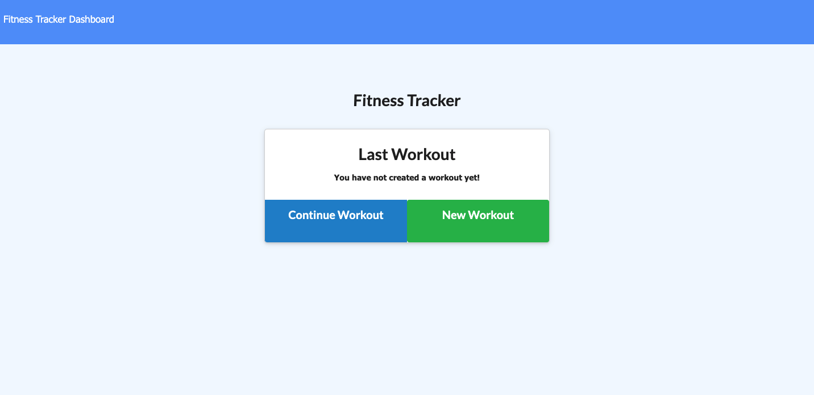
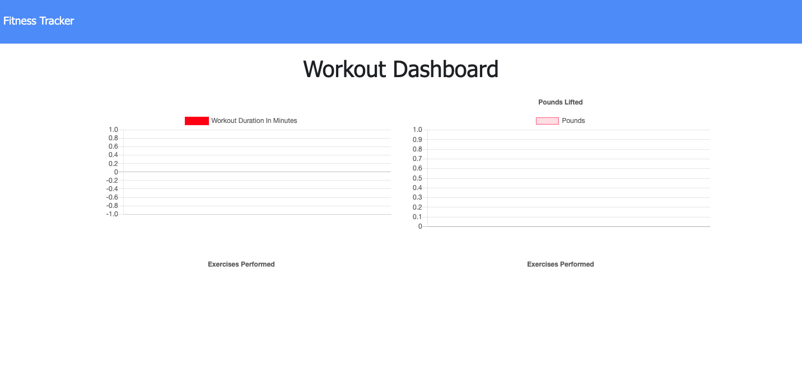
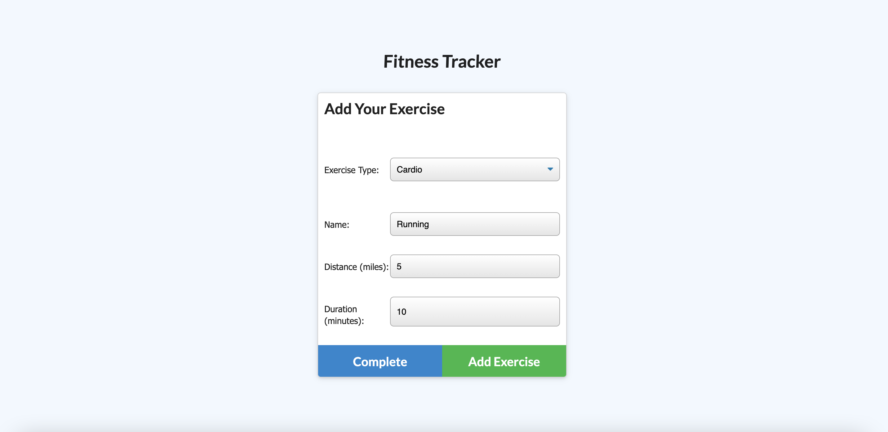
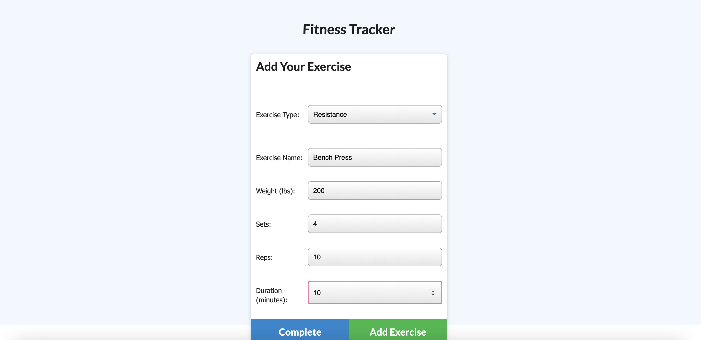

# Workout_Tracker

## Links: 
* Github Repository: https://github.com/ncerva/Workout_Tracker
* Heroku Deployed: https://glacial-inlet-44299.herokuapp.com/
## User Story

* As a user, I want to be able to view create and track daily workouts. I want to be able to log multiple exercises in a workout on a given day. I should also be able to track the name, type, weight, sets, reps, and duration of exercise. If the exercise is a cardio exercise, I should be able to track my distance traveled.

## Description 

This app allows users to track their progress on their daily workout routines. Users are able to input multiple exercises with details such as weights lifted, reps, sets, as well as distance ran and timing. 

